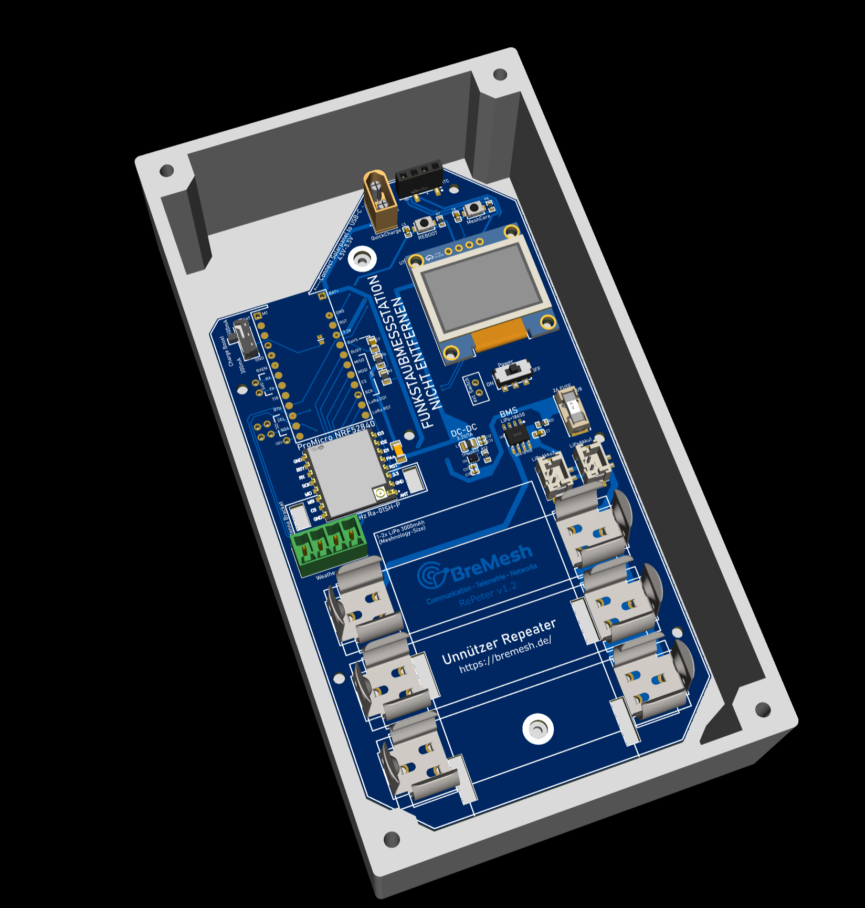

# BreMesh Repeater "RePeter"

MeshCore Narrow Repeater fürs BreMesh.de

EasyEDA BreMesh-Team: https://u.easyeda.com/bremesh

"Lieber was unnötiges machen, als nur dumm zu reden" - Irgendjemand, sicherlich.

## Features
- MCU:            nRF52840 on a ProMicro Board
- RF:	            2 Optionen: HT-RS62, Ra-01SH-P oder (Ra-01SCH-P - no experience with). 
- Akku:			      1-3x 18650 OR 1-2x 3000mAh (expandable via QuickCharge Port)
- BMS: 			      XB8789D0 1S 3.2V-4,2V
- ChargeIC:       LTH7R - 4.5V - 5.5V to 4.3V, 300/500mAh via USB-C Port.
- DC-DC:          TPS62840DLCR 3.3V/1A with deep sleep function (optional)
- Display:        SSD1513 0,96" 128x64 OLED via i2c (optional)
- RTC:			      TinyRTC via i2c (optional)
- Temp. Sensor    DHT11 via i2c (optional)
- Weather Sensor: BME280 via i2c (optional)
- Fuse:			      2A - replacable (optional - else: 0Ohm Resistor)

- Additional Ports
  - 2xI2C (6x total)
	- GPS
	- Externer PowerSwitch
- QuickCharge Port:
  - This Port is also Active while the Power is OFF. Its made to make use of external quickcharger. Also this can be used to connect more 1S Batteries if needed.

# Komponents

## Antenna

- Alfa 868MHz
  - https://quantumlink.shop/products/alfa-aoa-868-5acm-5dbi-868mhz-outdoor-lora-antenne
  - 16€ mit Versand

## Mikrocontroller

- nRF52840 Controller in Form eines ProMicro Board - dieses ist mit abstand die stromsparenste Alternative. Produkte wie SenseCap, HelTec Tracker usw. benutzen ebenfalls diesen MCU. 
  - https://a.aliexpress.com/_EHdhbaG
  - ~3€ - 10 Stück 27€ mit Versand.

## LoRa-Funkchip

- Ra-01SH IC:SX1264 +22dBm (Diesen Chip verwende ich zur Zeit)
  - günstigste Variante, soll evtl. bei niedrigen Temperaturn Probleme machen - noch nicht Feststellen können.
  - https://a.aliexpress.com/_EJohH6k
  - ~3,50€ - 17,09€ für 5 mit Versand
- HT-RA62 IC:SX1264 +22dBm
  - Solidester 22dBm Chip laut Internet - teurer - noch keinen Unterschied gemerkt.
  - ~4€ - 37,18€ für 10 mit Versand

