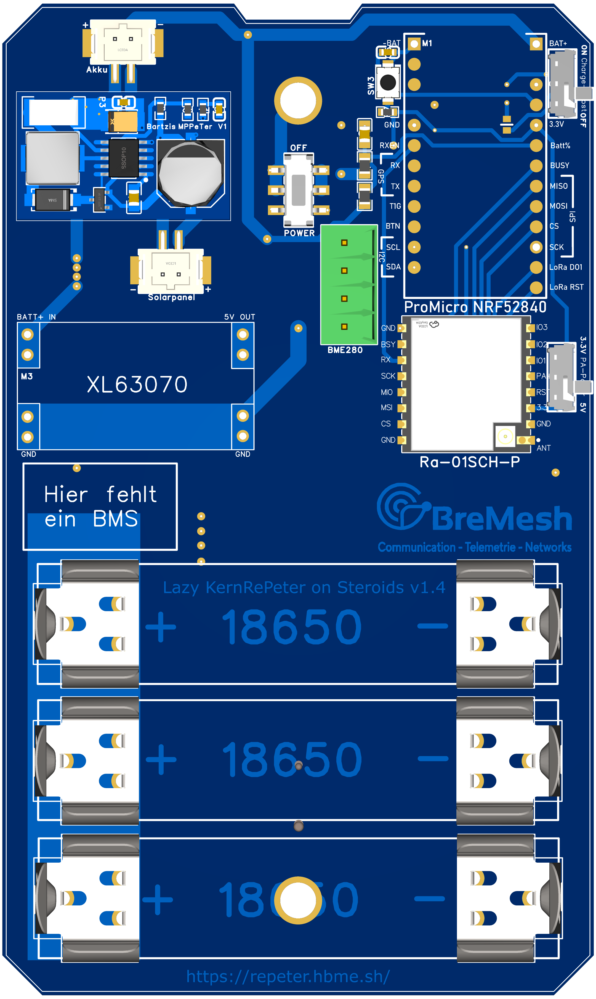

# BreMesh Repeater "RePeter"
MeshCore Narrow Repeater fürs BreMesh.de

EasyEDA BreMesh-Team: https://u.easyeda.com/bremesh

Als Projekt zum mal zu lernen, wie ich ein PCB Designen kann, habe ich mir einen MeshCore Repeater als Vorbild genommen. 

Um das Projekt https://bremesh.de/ mit weiteren Repeatern zu unterstützen, ist mir die Idee gekommen einen simplen, günstigen und effizienten Solarbetriebenen MeshCore Repeater zu bauen. 

Für mich steht hier ganz klar der Weg im Vordergrund, um für mich zu lernen. 

# Komponenten
generell brauchen wir für einen solchen Repeater

- Wetterfestes Gehäuse
- Solarpanel
- Antenne
  - Alfa 868MHz
    - https://quantumlink.shop/products/alfa-aoa-868-5acm-5dbi-868mhz-outdoor-lora-antenne
- Akkus
- Laderegler (Mit oder ohne MPPT)
- Mikrocontroller
  - nRF52840 Controller in Form eines ProMicro Board
    - https://a.aliexpress.com/_EHdhbaG
- LoRa Funkchip
  - Hier gibt es einige Optionen zu denen ich noch keine klare Meinung habe
    - Ra-01SH IC:SX1264 +22dBm (Diesen Chip verwende ich zur Zeit)
      - günstigste Variante, soll evtl. bei niedrigen Temperaturn Probleme machen - noch nicht Feststellen können.
      - https://a.aliexpress.com/_EJohH6k
    - Ra-01SCH-P IC:??? +31dBm
      - Nicht dokumentiert, dass dieser Chip in der Kombination funktioniert. Kann laut Datenblatt bis zu 2.5w Sendeleistung erreichen für die Meshtastic-Unencrypted-Lizenz-Funker mit zusätzlicher 5v DC-DC Stromverbindung am PA-Pin
      - https://a.aliexpress.com/_EIKJRxq
    - HT-RA62 IC:SX1264 +22dBm
      - Solidester 22dBm Chip laut Internet - teurer
- opt. Batteriemanagementsystem
- opt. DC-DC 5V Wandler
- opt. Sensoren

Zubehör:
- Silikon
- Antennendichtband