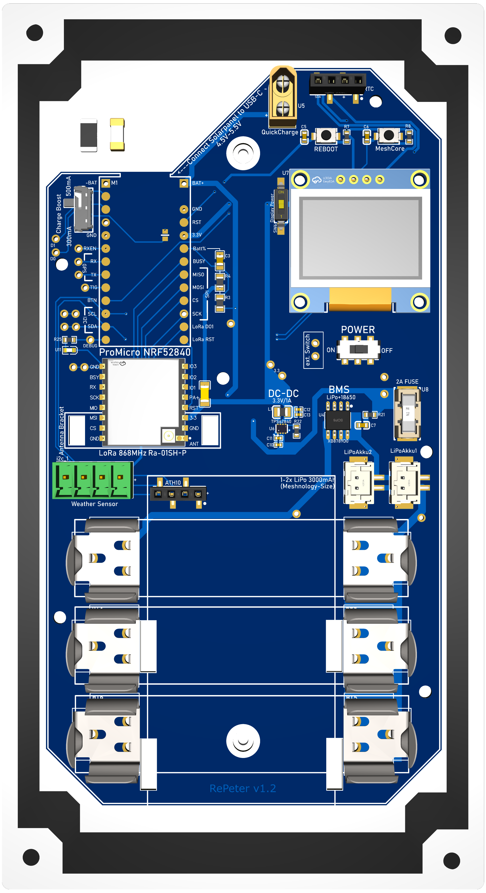
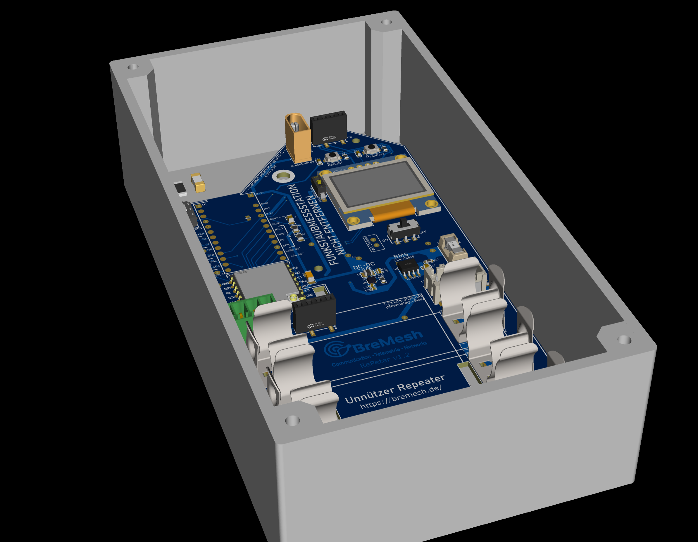
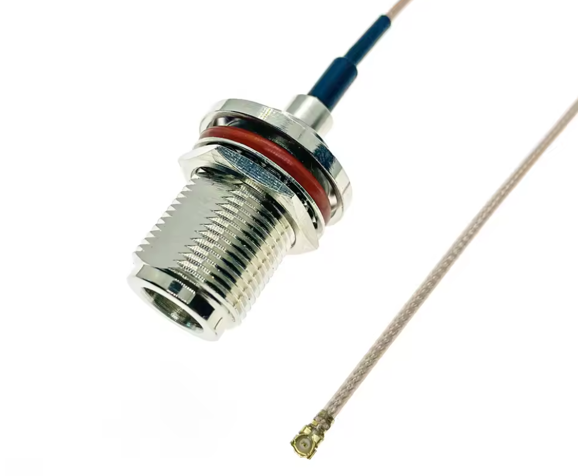
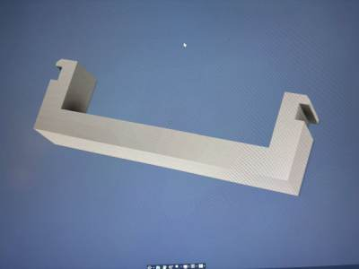
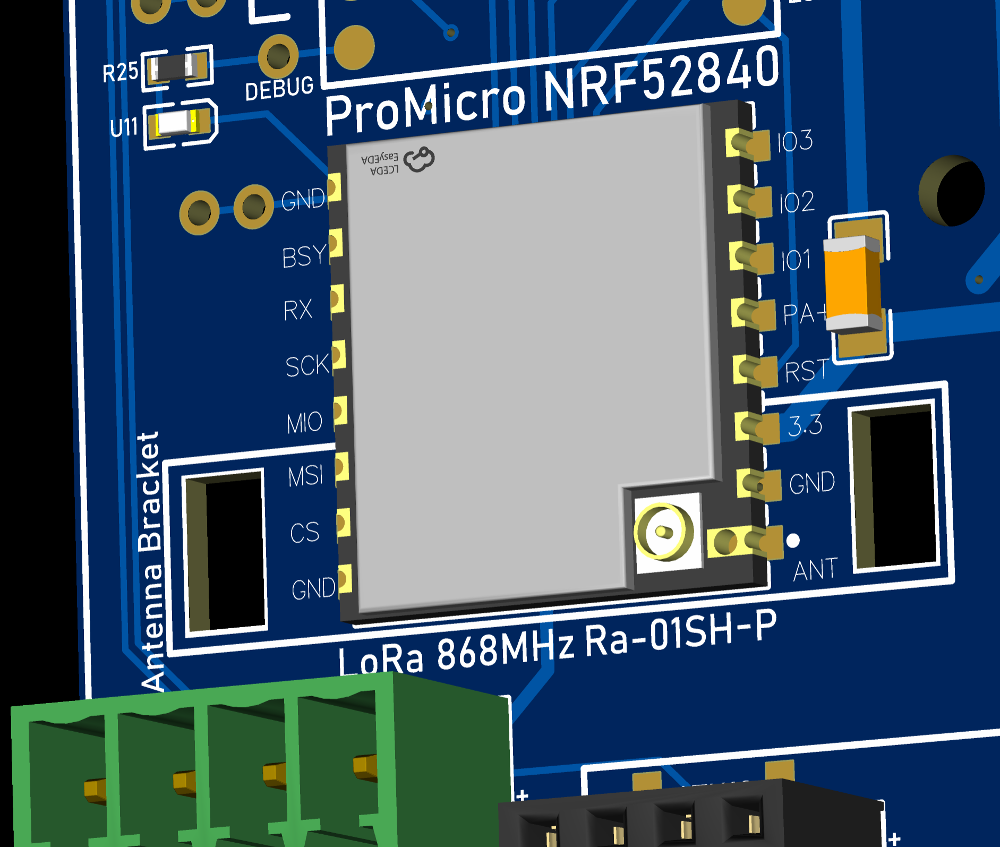
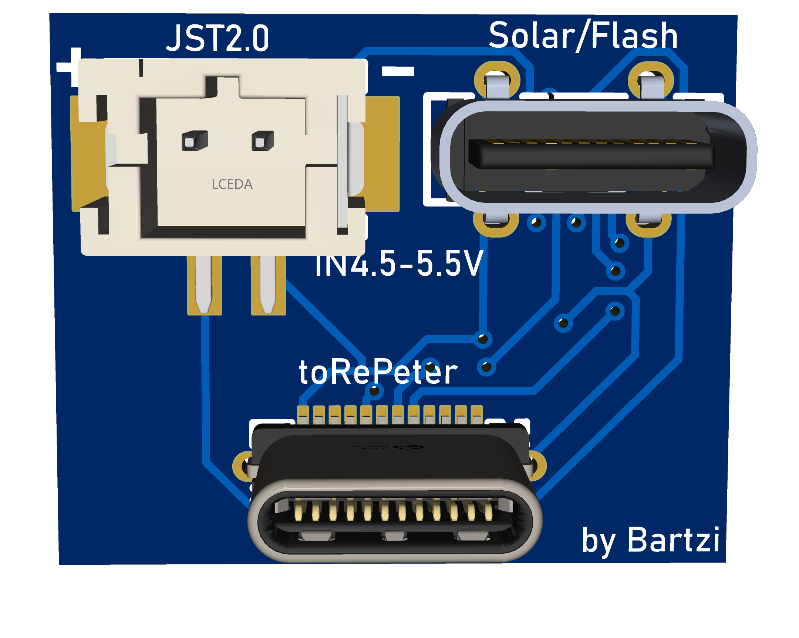
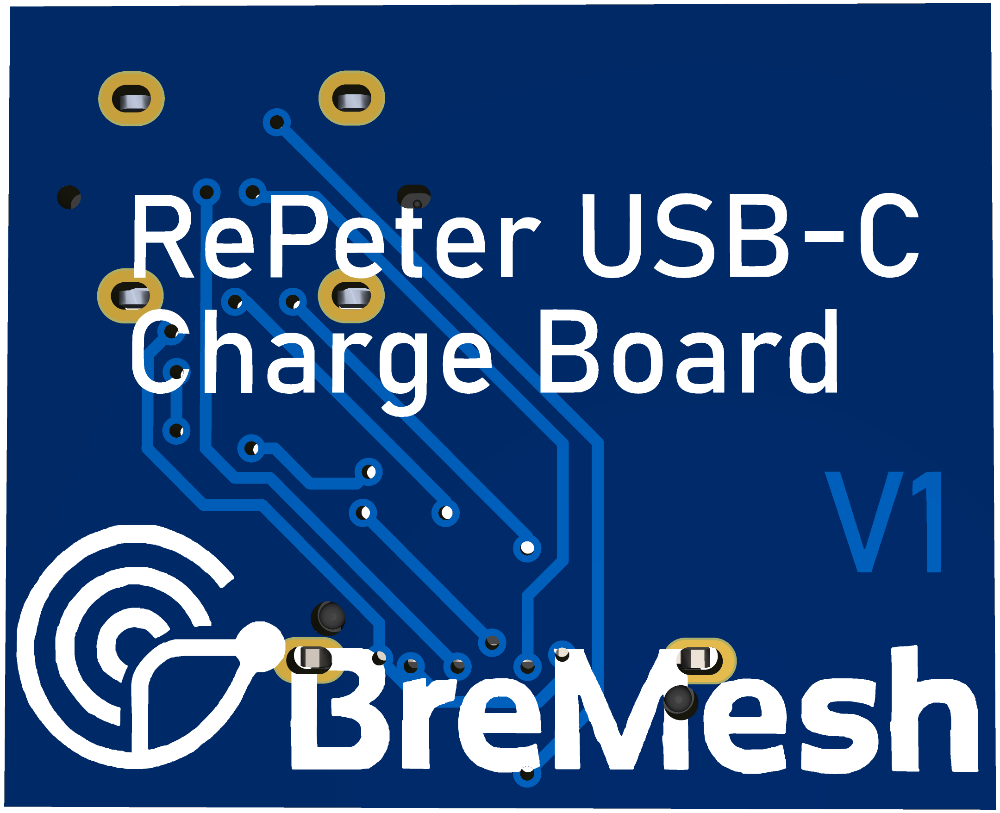
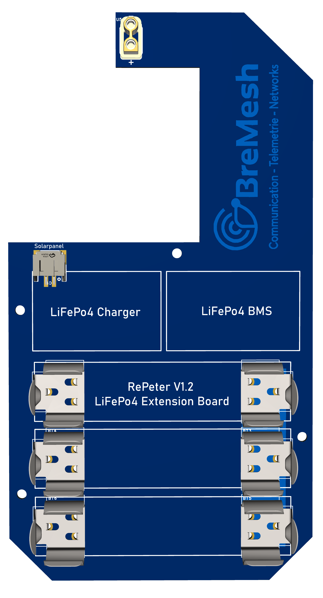

# MeshCore Narrow Repeater RePeterV1.2

MeshCore Narrow Repeater for [BreMesh.de](https://bremesh.de/)

EasyEDA BreMesh-Team: https://u.easyeda.com/bremesh

RePeter Firmware by [Nagios](https://github.com/timniklas/MeshCore-Bremen)

---

**Note:** After building several FakeTecV4 boards ([GitHub](https://github.com/gargomoma/fakeTec_pcb/issues/16)), I wanted to build my own affordable and versatile repeater.  This is a learning project for me. These are my first attempts and I make no claims that any of this actually works.

---

- 2026-01-04 - V1.2 Completed. Parts for 10 boards ordered - tests pending

## Configurations

### Basic Configuration RePeter1.2 - 1 Akku, BMS

| Part                                                                                                        | Designator | Quantity            | Price            | Total             |
| ----------------------------------------------------------------------------------------------------------- | ---------- | ------------------- | ---------------- | ----------------- |
| [ProMicro nRF52](https://github.com/joric/nrfmicro/wiki/Alternatives/dd5782fb56855cc7e24e884f1e423d664da34db1) | M1         | 1                   | 2,70€           | 2,70€            |
| [Ra-01SH-P](Documentation/RF/Ra-01SH-P.pdf)/[HT-RA62](Documentation/RF/HT-RA62(Rev1.1).pdf)                       | M2         | 1                   | 3,50€           | 3,50€            |
| 1M Ohm Resistor 0603                                                                                        | R3,R4      | 2                   | 0,0025€         | 0,01€            |
| 3x4mm SMD Button                                                                                            | REBOOT     | 1                   | 0,038€          | 0,04€            |
| Slide Switch Power                                                                                          | SW4        | 1                   | 0,29€           | 0,29€            |
| 0Ohm Resistor 1208                                                                                          | U8         | 1                   | 0,06€           | 0,06€            |
| 100Ohm Resistor 0603                                                                                        | R21        | 1                   | 0,0012€         | 0,01€            |
| 100nF Cap. 0603                                                                                             | C7         | 1                   | 0,003€          | 0,01€            |
| BMS XB8789D0 SOP-8-EP                                                                                      | U4         | 1                   | 0,20€           | 0,20€            |
| MY-18650-1 Holder                                                                                           | BT1,BT2    | 2                   | 0.24€           | 0,48€            |
|                                                                                                             |            |                     |                  | **7,30€**  |
|                                                                                                             |            |                     |                  |                   |
|                                                                                                             |            | PCB                 | 2,50€           | **9,80**    |
|                                                                                                             |            | Case                | 5,69€           | **15,49€** |
|                                                                                                             |            | Antenna             | 14€             | **29,49€** |
|                                                                                                             |            | N-Type Adapter+Tape | 5€              | **34,49€** |
|                                                                                                             |            | Akku                | 5€              | **39,49€** |
|                                                                                                             |            | Solarpanel          | 5€              | **44,49€** |
|                                                                                                             |            |                     |                  |                   |
|                                                                                                             |            |                     | **Total:** | **~45€**   |

(more configurations soon)

## Features

- MCU:            [nRF52840 on a ProMicro Board](https://github.com/joric/nrfmicro/wiki/Alternatives/dd5782fb56855cc7e24e884f1e423d664da34db1)

  - Ultra-low power: ~1Wh/day consumption
  - Multiple GPIO, I2C, SPI, UART interfaces
- RF:	            2 Options: [HT-RA62](Documentation/RF/HT-RA62(Rev1.1).pdf) or [Ra-01SH-P](Documentation/RF/Ra-01SH-P.pdf)

  - Both: Semtech SX1262, +22dBm TX, -148dBm RX, 863-928MHz
  - HT-RA62: better cold tolerance and performance ([pinmap](Documentation/RF/HT-RA62-Pinmap.png), [reference design](Documentation/RF/HT-RA62_Reference_design.pdf))
  - LoRa/FSK/GFSK modulation, 4.2mA RX, 120mA TX @ +22dBm
- Battery:		      1-3x 18650 OR 1-2x 3000mAh (expandable via QuickCharge Port)
- BMS: 			      XB8789D0 1S 3.2V-4.2V

  - Overcharge Protection (4.2V ±0.05V)
  - Over-discharge Protection (2.5V ±0.1V)
  - Overcurrent Protection (3-5A)
  - Short Circuit Protection
- ChargeIC:       [LTH7R](Documentation/ProMicro/Charger-IC_LTH7R.PDF) - 4.5V - 5.5V to 4.3V, 300/500mAh via USB-C Port

  - Constant Current/Constant Voltage (CC/CV) charging
  - Programmable charge current up to 500mA (set up to 500mA)
  - Charge voltage: 4.2V (1% accuracy)
  - Trickle charge: 2.9V
  - Thermal protection with automatic current regulation
  - Automatic charge termination at 1/10th charge current
  - Auto-recharge function
  - Standby current: <25uA
  - No external MOSFET, sense resistor or blocking diode required
  - Charge status indication
- DC-DC:          TPS62840DLCR 3.3V/750mA with deep sleep function (optional)

  - Input voltage: 1.8V to 6.5V
  - Output voltage: 3.3V (fixed)
  - Output current: 750mA max
  - Quiescent current (IQ): 60nA (ultra-low power)
  - Efficiency: >90% at light loads
  - DCS-Control (Dynamic Current Scaling)
  - EN (Enable) pin for shutdown control (deep sleep mode)
- Display:        SSD1306 0.96" 128x64 OLED via i2c (optional)
- RTC:			      TinyRTC via i2c (optional)
- Temp. Sensor (inside)   AHT10 via i2c (optional)

  - Temperature range: -40°C to +85°C
  - Temperature accuracy: ±0.3°C
  - Humidity range: 0-100% RH
  - Humidity accuracy: ±2% RH
  - Low power consumption: <1µA in sleep mode
- Weather Sensor: BMP280 via i2c (optional)

  - Pressure range: 300-1100 hPa
  - Pressure accuracy: ±1 hPa
  - Temperature range: -40°C to +85°C
  - Temperature accuracy: ±1°C
  - Low power consumption: <3µA in sleep mode
- Fuse:			      2A - replaceable (optional - else: 0Ohm Resistor)
- Additional Ports

  - 2xI2C (6x total)
    - GPS
    - External PowerSwitch
- QuickCharge Port:

  - This port is also active while the power is OFF. It's made to make use of external quickcharger. Also this can be used to connect more 1S batteries if needed.

# Components

## Antenna

- Alfa 868MHz
  - https://quantumlink.shop/products/alfa-aoa-868-5acm-5dbi-868mhz-outdoor-lora-antenne
  - 16€ with shipping

### Antenna N-Type Connector

- ~ 4€ [AliExpress](https://de.aliexpress.com/item/1005006171666073.html)
- ~11€ [Amazon](https://www.amazon.de/Vecys-Koaxialkabel-Wireless-Netzwerkkarten-Repeater/dp/B0C8J131PD)

### Antenna Bracket

To securely mount the U.FL adapter on the board, an antenna bracket has been designed. This bracket ensures a stable connection and prevents stress on the delicate U.FL connector during installation and operation.

 

## Case

- 5,69€ [AliExpress](https://a.aliexpress.com/_EznOlhm)

## Solar Panel 5V

- 2W 4,49€ [AliExpress](https://a.aliexpress.com/_EvV01rK)
- 3W ~ 12€

**Note on MPPT:** This design intentionally does not include MPPT (Maximum Power Point Tracking). For small solar panels (2-3W/5V), the added cost and complexity of MPPT circuitry outweigh the marginal efficiency gains. The simple direct charging approach keeps the design affordable and minimizes component count. For detailed analysis on MPPT benefits and when it makes sense, see [Documentation/MPPT.md](Documentation/MPPT.md).

### Connecting the Solar Panel

The ProMicro's charge IC is only accessible via the USB-C port. No pins on the header or under the board connect to it.

Due to the design and board layout, it is difficult to connect a non-USB-C solar panel. Additionally, the space inside the case is often insufficient due to the length of the USB-C connector.

For this reason, I have developed a small adapter board that plugs into the ProMicro's USB-C port and provides both a USB-C and a JST2.0 connector. This enables easy connection of standard solar panels with JST2.0 connectors or USB-C. Additionally, for programming/updating the firmware, the data ports on the Flash-Port can be used.

 

More information and manufacturing files: [ProMicro ChargeBoard README](RePeter_Tools/ProMicro_ChargeBoard/README.md)

## Batteries

### 18650

- https://www.nkon.nl/de/rechargeable/li-ion/18650-size.html?brand=Samsung&protected=Ohne
- 1x 5€ ~ 10Wh ~ 7-10 days battery life
- 2x 10€ ~ 20Wh ~ 14-20 days battery life
- 3x 15€ ~30Wh ~ 3-4 weeks battery life

### LiPo

- [Amazon](https://www.amazon.de/Meshnology-USB-Ladekabel-103665-Schutzplatine-ESP32-Modulplatine-Schwarz/dp/B0F1FHHH5X/)
- 1x 7.50€ ~ 11Wh ~ 8-10 days battery life
- 2x 15€ ~ 22Wh ~ 16-21 days battery life

### LiFePo4

- Not supported by the board BUT not impossible.
- Operation with LiFePo4 possible if the following is self-made:
  - LiFePo4 Battery -> appropriate BMS -> LiFePo4 Charger <- Solar Panel
    - In this configuration, the charger can be connected to the QuickCharge port.
    - If this route is chosen, the BMS, fuse, and battery holders no longer need to be populated.
    - Through this route with a LiFePo4 PCB with the corresponding components e.g. in the lid, the RePeter can also be used for this purpose.

*Note: This is a concept design for a possible LiFePo4 extension board for RePeter V1.2*

## PCB RePeterV1.2

- 2.50€ - 10x ordered, 25€ with shipping + customs

### MCU

- nRF52840 in the form of a ProMicro Board - this is by far the most power-efficient alternative. Products like SenseCap, HelTec T114 etc. also use this MCU. Consumes approx. 1Wh/day.
  - https://a.aliexpress.com/_EHdhbaG
  - ~3€ - 10 pieces 27€ with shipping.

### LoRa Radio Chip

- [Ra-01SH-P](Documentation/RF/Ra-01SH-P.pdf) +22dBm (This is the chip I currently use)
  Cheapest option, supposedly has problems at low temperatures - haven't been able to confirm yet.
  - https://a.aliexpress.com/_EJohH6k
  - ~3.50€ - 34.50€ for 10 with shipping
- [HT-RA62](Documentation/RF/HT-RA62(Rev1.1).pdf) +22dBm
  - better cold tolerance
  - Most solid 22dBm chip according to the internet - more expensive - haven't noticed any difference yet.
  - ~4€ - 37.18€ for 10 with shipping
