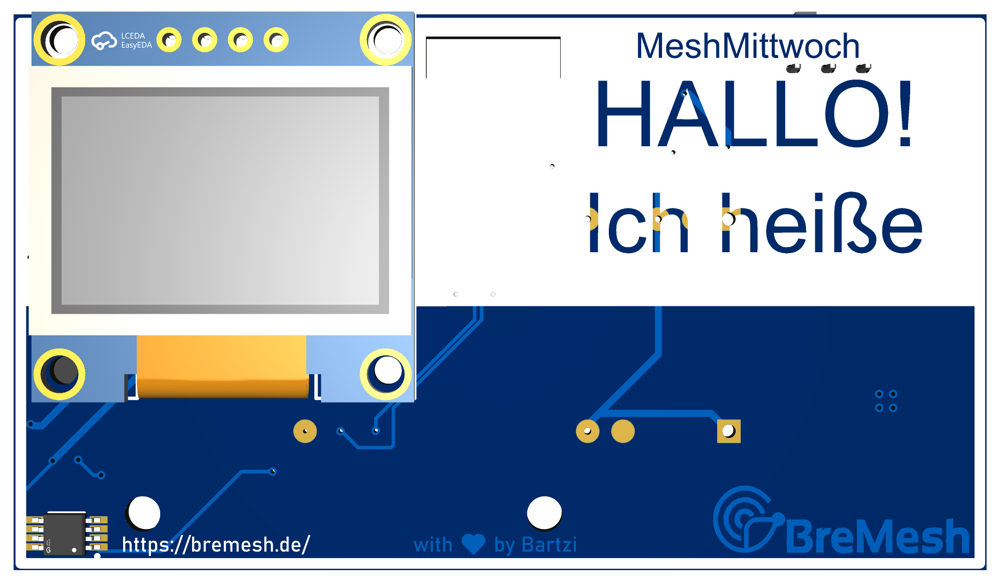
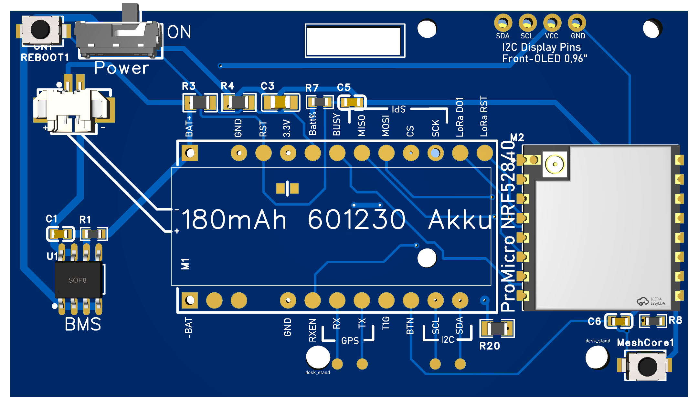
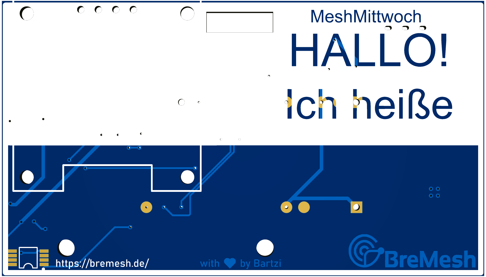
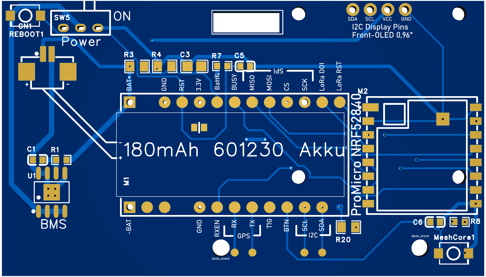

# RePeter NameTag

Ein unnötig-kompliziertes elektronisches Namensschild als PCB im Badge-Format für das BreMesh.de Projekt, welches aus viel Langeweile entwickelt wurde.

Ich habe initial 20 Stück bestellt und werde diese an Jörg übergeben zum Verteils im Rahmen des Stammtisches.

##  Übersicht

Das RePeter NameTag ist ein designtes PCB-Badge, welches als Namensschild für den Stammtisch MeshMittwoch benutzt werden kann UND oder als funktionsfähiges MeshCore Device.

##  Features

### Als funktionsfähiges MeshCore Device
- 📡 **MeshCore-fähig**: Vollständig kompatibel mit MeshCore-Firmware
- 🔋 **Batteriebetrieb**: Integriertes Battery-ManagementSystem für LiPo/18650-Akkus
- 🎯 **Kompakt**: Alle Komponenten auf Badge-Größe integriert
- 🔌 **USB-C**: Programmierung und Laden über USB-C Anschluss
- 📺 **Display integriert**: OLED-Display für Status und Nachrichten
- 🌡️ **Temperatursensor**: 1-Wire Sensor für Umgebungstemperatur (Falls nagi0s den integriert... ;) 

## 📐 Technische Spezifikationen

### Hardware-Komponenten

#### Mikrocontroller (Pro Micro)
- **Chip**: nRF52840 (Nordic Semiconductor)
- **Architektur**: ARM Cortex-M4F mit 64 MHz
- **Flash**: 1 MB
- **RAM**: 256 KB
- **Bluetooth**: BLE 5.0 / 5.1 / 5.2
- **USB**: Native USB 2.0 Full-Speed
- **Form Factor**: Pro Micro kompatibel

#### LoRa-Modul
- **Chip**: RA-01SH (SX1262/SX1268)
- **Frequenz**: 868 MHz (EU) / 915 MHz (US)
- **Sendeleistung**: bis zu +22 dBm
- **Empfindlichkeit**: bis zu -148 dBm
- **Reichweite**: 10+ Kilometer (je nach Umgebung)

#### Display
- **Typ**: 0.96" OLED (128x64 Pixel)
- **Controller**: SSD1306
- **Schnittstelle**: I2C

#### Temperatursensor
- **Typ**: DS18B20
- **Protokoll**: 1-Wire
- **Messbereich**: -55°C bis +125°C
- **Genauigkeit**: ±0.5°C

#### Ladechip (auf Pro Micro)
- **Chip**: LTH7R
- **Typ**: USB-C Power Delivery und Laderegler
- **Eingangsspannung**: 5V via USB-C
- **Ausgangsspannung**: 4.2V auf BAT+/-
- **Funktionen**:
  - USB-C Power Delivery Unterstützung
  - Batterie-Laderegelung
  - Spannungsregelung für Mikrocontroller
- **Datenblatt**: Siehe Documentation Ordner

#### Battery Management System (BMS)
- **Chip**: XB8789D0
- **Funktion**: Batterieschutz und -management
- **Ladestrom**: einstellbar (typisch 100-500mA)
- **Schutzfunktionen**:
  - Überladungsschutz
  - Tiefentladungsschutz
  - Kurzschlussschutz
  - Übertemperaturschutz
- **Akku**: 601230 LiPo (180mAh, 3.7V)
  - Kapazität: ~0.67Wh
  - Passt unter Pro Micro bei Pin-Header-Montage
  - **Akku-Laufzeit**: ca. 16 Stunden bei typischem Betrieb (~1Wh/24h)

### Elektrische Eigenschaften

| Parameter | Min | Typ | Max | Einheit |
|-----------|-----|-----|-----|---------|
| Versorgungsspannung (USB/Solar) | 4.5 | 5.0 | 5.5 | V |
| Versorgungsspannung (Battery) | 3.2 | 3.7 | 4.2 | V |

### Anschlüsse & Schnittstellen

- **USB-C**: Laden & Datenkommunikation
- **Batterieanschluss**: JST 1.25mm (601230 LiPo empfohlen)
- **Antenne**: U.FL / IPEX Anschluss
- **Display**: 0.96" OLED über I2C (fest verbaut)
- **1-Wire**: DS18B20 Temperatursensor (fest verbaut)
- **GPIO**: Mehrere verfügbare Pins für Erweiterungen
- **I2C**: Display + frei für weitere Sensoren

### PCB-Eigenschaften
- **Material**: FR4
- **Lagenzahl**: 2-Layer
- **Dicke**: 1.6mm
- **Kupferstärke**: 1oz (35µm)
- **Oberflächenbehandlung**: HASL / ENIG
- **Bestückung**: SMD-Komponenten (0603)

### Software & Firmware

- **MeshCore**: Hauptfirmware für Mesh-Netzwerke (basiert auf Meshtastic)
- **Bootloader**: UF2 Bootloader (USB Mass Storage)
- **Programmierung**: USB-C direkt, SWD Debug-Header
- **Entwicklung**: Arduino IDE, PlatformIO

### Reichweite & Performance

| Szenario | Erwartete Reichweite |
|----------|---------------------|
| Stadt (dichte Bebauung) | 500m - 2km |
| Vorstädte (offener) | 2km - 5km |
| Ländlich / Freies Feld | 5km - 15km |
| Mit Höhe (Berg, Turm) | bis 40km+ |

*Reichweite abhängig von Antenne, Höhe, Topografie und Hindernissen*

## 📦 Projektdateien

Im Repository befinden sich folgende Dateien:

| Datei | Beschreibung |
|-------|--------------|
| [Gerber_RePeter_NameTag_V1_2025-12-26.zip](Gerber_RePeter_NameTag_V1_2025-12-26.zip) | Gerber-Dateien für PCB-Fertigung |
| [SCH_RePeter_NameTag_V1_2025-12-26.pdf](SCH_RePeter_NameTag_V1_2025-12-26.pdf) | Schaltplan |
| [BOM_RePeter_NameTag_RePeter_NameTag_V1_2025-12-26.xlsx](BOM_RePeter_NameTag_RePeter_NameTag_V1_2025-12-26.xlsx) | Stückliste |
| [3D_RePeter_NameTag_V1_2025-12-26.zip](3D_RePeter_NameTag_V1_2025-12-26.zip) | 3D-Modell |
| [Badge_Front.png](Badge_Front.png) / [Badge_Back.png](Badge_Back.png) | Design-Vorschau |
| [Badge_Front_blanko.png](Badge_Front_blanko.png) / [Badge_Back_blanko.png](Badge_Back_blanko.png) | Blanko-Vorlagen |

## 🎨 Anpassung

### Blanko-Vorlagen

Die Blanko-Vorlagen ([Badge_Front_blanko.png](Badge_Front_blanko.png) und [Badge_Back_blanko.png](Badge_Back_blanko.png)) können verwendet werden, um:

- Namen individuell anzupassen
- Zusätzliche Texte hinzuzufügen
- Das Design nach eigenen Wünschen zu modifizieren

### Design-Anpassungen in EasyEDA

1. **Projekt öffnen**: Importiere die Dateien in EasyEDA
2. **Text ändern**: Passe Namen, Texte und Labels an
3. **Logo hinzufügen**: Eigene Logos oder QR-Codes einfügen
4. **Farben**: Lötmaske und Bestückungsdruck-Farben ändern
5. **Export**: Neue Gerber-Dateien generieren

### Anwendungsfälle

#### Als reines Namensschild
- Minimale Bestückung ohne elektronische Komponenten möglich
- Nur PCB mit Namensaufdruck

#### Als vollwertiges MeshCore-Device
- Vollständige Bestückung gemäß BOM
- Firmware flashen und konfigurieren
- Als mobiler Mesh-Node oder Repeater nutzen

#### Als Lernprojekt
- Perfekt zum Lernen von:
  - PCB-Design
  - SMD-Löten
  - Embedded Programming
  - LoRa/MeshCore-Technologie

## 🚀 Inbetriebnahme

### 1. Hardware-Check
- [ ] Visuelle Inspektion auf Lötstellen und Kurzschlüsse
- [ ] Spannungsversorgung testen (USB-C anschließen)
- [ ] LED-Status prüfen (Power-LED sollte leuchten)

### 2. Firmware flashen
Via MeshCore Webseite

### 3. Testen
- Reichweiten-Test mit anderem MeshCore-Device
- Batterie-Laufzeit messen
- Mesh-Nachrichten senden/empfangen

## 🔧 Troubleshooting

### Häufige Probleme

| Problem | Lösung |
|---------|--------|
| Device wird nicht erkannt | USB-Kabel prüfen, Treiber installieren |
| Keine LoRa-Reichweite | Antenne richtig angeschlossen? Frequenz korrekt? |
| Akku lädt nicht | TP4056 Chip korrekt bestückt? Polarität prüfen |
| Firmware flasht nicht | Bootloader-Modus aktivieren (Doppel-Reset), Verbindungen prüfen!|

### Debug-Tipps
- Serielle Konsole öffnen (115200 Baud)
- Log-Ausgaben analysieren
- Spannungen mit Multimeter messen
- in der Meshtastic Bremen Telegramm Gruppe nett fragen.

## 🔗 Verwandte Projekte

Dieses Badge ist Teil des [BreMesh RePeter Projekts](../README.md), einem MeshCore Repeater für das BreMesh.de Netzwerk.

- 🌐 **BreMesh Website**: [bremesh.de](https://bremesh.de/)
- 📱 **EasyEDA Projekt**: [BreMesh-Team auf EasyEDA](https://u.easyeda.com/bremesh)

## 📄 Lizenz

Dieses Projekt ist Teil des BreMesh Open-Source Projekts.

## 🤝 Beitragen

Verbesserungsvorschläge und Anpassungen sind willkommen!

1. Fork das Projekt
2. Erstelle einen Feature Branch
3. Commite deine Änderungen
4. Push zum Branch
5. Öffne einen Pull Request

## 👤 Autor

Entwickelt als Teil des BreMesh-Projekts zum Lernen von PCB-Design.

---

**Hinweis**: Die Dateien wurden am 26.12.2025 erstellt und entsprechen der Version V1 des Designs.
