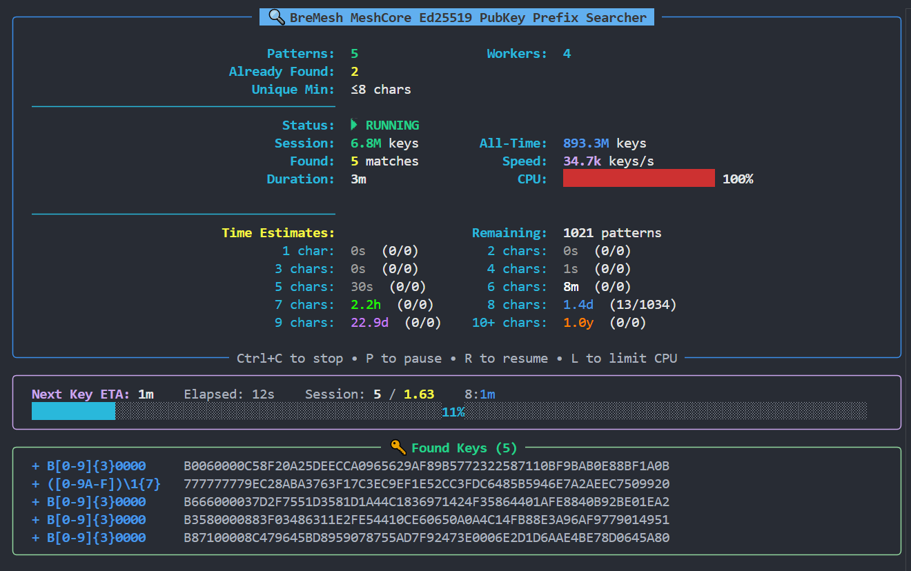

# BreMesh MeshCore Ed25519 PubKey Searcher

A high-performance Python script for generating Ed25519 key pairs with custom public key prefixes.

Perfect for memorable keys for **MeshCore** repeaters!

---

## Recommendation for Simple Keys

**For simple, single keys I recommend:** [https://gessaman.com/mc-keygen/](https://gessaman.com/mc-keygen/)

This website is perfect for quick, straightforward key generation and I highly recommend it. In fact, this site was my inspiration for this tool - I wanted to create a way to **search for multiple complex keys simultaneously**, to save resources and time when configuring multiple repeaters with custom patterns.

**GitHub:** [https://github.com/agessaman/meshcore-web-keygen](https://github.com/agessaman/meshcore-web-keygen)

**Use this tool when:**

- You want to search for multiple keys with different patterns simultaneously
- **You need flexible regex patterns (e.g., F[0-9]{3} for 1000 variations)**
- You need more complex/longer patterns (7+ characters)
- You have a pattern list and want to generate all keys in one run
- You want to utilize the full CPU power of your system



## Features

### Regex Pattern Matching (NEW!)

- **Powerful Regex Engine** - Support for character classes, quantifiers, and backreferences
- **Variable-Length Patterns** - Single pattern matches multiple lengths (e.g., `{1,57}`)
- **Smart ETA Calculation** - Accurate time estimates for each pattern length
- **Auto-Continue** - Resume interrupted searches automatically
- **HEX-Compatible** - Only allows valid HEX patterns (0-9, A-F)
- **Hot-Reload Support** - Add new regex patterns during search

### Performance

- **Multi-Core Processing** - Uses all available CPU cores for maximum speed
- **Optimized Key Generation** - Ed25519 Elliptic Curve Cryptography
- **HEX Format** - MeshCore-compatible format (64-character HEX Public Key)

### User Interface

- **Rich Live Display** - Flicker-free terminal UI using the `rich` framework
- **Alternate Screen Buffer** - Professional full-screen display like `htop`
- **Three-Panel Layout** - Main statistics, ETA progress bar, found keys
- **Color-Coded Display** - Clear presentation of all statistics
- **CPU Usage Display** - Graphical progress indicator with color coding
- **Rarity Indicators** - Color marking based on pattern length
- **Progress Display** - Shows found/searched patterns per length category

### Control

- **Pause/Resume** - Pause with `P`, resume with `R`
- **CPU Limiting** - Limit CPU to ~75% with `L` (pauses 25% of workers)
- **Graceful Shutdown** - Clean exit with `Ctrl+C` and summary
- **Keyboard Listener** - Responds to input during search
- **Single Pattern Mode** - Search for single pattern with auto-exit on find

### Statistics

- **Live Statistics** - Real-time display of progress and speed
- **Session Stats** - Current session: Keys checked, matches found, runtime
- **All-Time Stats** - Total keys checked across all sessions (persistent)
- **Time Estimates** - Calculated probabilities with accurate distribution for variable-length patterns
- **Remaining Counter** - Shows remaining patterns total and per category
- **Next Key ETA** - Mathematical estimate with proper handling of variable-length regex patterns
- **Per-Length ETAs** - Individual ETA timers per pattern length (5-10, 11+ in red)
- **Session Progress** - Shows found vs. expected keys (e.g., `1 / 1.4`)
- **Verbose Mode** - Shows ETA calculation formula with `-v` flag
- **Pattern Distribution** - Variable-length patterns distributed across categories (e.g., DEADBEE{1,57}F shows as 1×8-char, 1×9-char, 55×10+-char)

### Management

- **Pattern File** - External pattern list for easy customization
- **Hot-Reload** - Pattern file reloaded every 30 seconds (works with plain and regex patterns)
- **Duplicate Detection** - Prevents duplicate finds for short patterns (configurable via `DEFAULT_UNIQUE_MIN`)
- **No Dup Cap** - Patterns above unique_min can be found any number of times
- **Persistent Storage** - Found keys saved immediately
- **JSON Export** - MeshCore-compatible import format
- **Search Continuation** - Automatically continues from existing regex pattern files
- **Auto-Sort** - Regex pattern files sorted alphabetically on completion or Ctrl+C

## Installation

### Prerequisites

- Python 3.7+
- pip

### Install Dependencies

```bash
pip install cryptography rich psutil
```

## Usage

### Quick Start

```bash
python keyfinder.py
```

### Search for Single Pattern (with Auto-Exit)

```bash
python keyfinder.py CAFE
# or with flag:
python keyfinder.py -p BREMESH
```

The script automatically exits once the pattern is found.

### Simple Console Output (for Scripts)

For script-friendly output without the Rich UI:

```bash
# Output only the 128-character private key:
python keyfinder.py CAFE -osc

# Output the full 192-character key (private + public):
python keyfinder.py CAFE -oscl
```

Perfect for automation and piping to other scripts.

### With Custom Pattern File

```bash
python keyfinder.py -f my_patterns.txt
# or:
python keyfinder.py --patterns-file my_patterns.txt
```

### With ETA Formula (Verbose Mode)

```bash
python keyfinder.py -v
```

### Control Worker Count

```bash
# Use only 4 CPU cores:
python keyfinder.py -w 4

# Use all available cores (default):
python keyfinder.py -w 0
```

### All Options

```bash
python keyfinder.py -f searchFor.txt -u 7 --output-dir found_keys -w 0 -v
```

## Configuration

### Command Line Arguments

| Argument                                    | Description                                   | Default                        |
| ------------------------------------------- | --------------------------------------------- | ------------------------------ |
| `pattern` (positional)                    | Pattern to search for (plain or regex)        | -                              |
| `-p`, `--pattern-flag`                  | Alternative way to specify pattern            | -                              |
| `-u`, `--unique-min`                    | Patterns with length <= this value are unique | `8` (configurable in script) |
| `-w`, `--workers`                       | Number of worker processes (0 = all cores)    | `0`                          |
| `-f`, `--patterns-file`                 | Path to pattern file                          | `searchFor.txt`              |
| `--output-dir`                            | Output directory for found keys               | `found_keys`                 |
| `-v`, `--verbose`                       | Show ETA calculation formula                  | -                              |
| `-osc`, `--output-simple-console`       | Simple output: 128-char private key only      | -                              |
| `-oscl`, `--output-simple-console-long` | Simple output: 192-char private+public key    | -                              |

### Environment Variables

Alternatively configurable via environment variables:

**Windows PowerShell:**

```powershell
$env:PATTERNS_FILE = "custom_patterns.txt"
$env:UNIQUE_MIN = 8
python keyfinder.py
```

**Linux/Mac:**

```bash
export PATTERNS_FILE=custom_patterns.txt
export UNIQUE_MIN=8
python keyfinder.py
```

### Create Pattern File

Create a text file with one pattern per line:

**Plain Patterns:**

```
CAFE
DEAD
BEEF
1234
ABCD
BREMESH
```

**Regex Patterns (see examples below):**

```
B[0-9]{3}0000        # 1000 variations
CA[0-9A]{2}          # 100 variations  
([0-9A-F])\1{7}      # All 8-char repeats
DEADBEE{1,57}F       # Variable length 8-64 chars
```

**Notes:**

- Only HEX characters allowed: `0-9` and `A-F`
- Case insensitive
- Lines starting with `#` are comments
- Empty lines are ignored
- Regex patterns automatically detected

---

## Regex Pattern Support (NEW!)

### Why Use Regex Patterns?

Instead of creating hundreds of individual pattern files, use **one regex pattern** to match thousands of possibilities:

**Example:** Instead of searching for B0010000, B0020000, B0030000... separately (1000 individual searches), use:

```
B[0-9]{3}0000
```

This single pattern finds **all 1000 variations** in one search!

### Basic Character Classes

Search for patterns with variable digits or letters:

```
B[0-9]{3}0000        # B0000000 to B9990000 (1000 possibilities)
B[0-9A-F]{1}000000   # B0000000 to BF000000 (16 possibilities)
CA[0-9A]{2}          # CA00 to CAAA (100 possibilities)
F[0-9A-F]{3}         # F000 to FFFF (4096 possibilities)
```

#### Variable-Length Patterns

Create patterns that match multiple lengths:

```
DEADBEE{1,57}F       # DEADBEEF (8 chars) to DEADBEE...EEF (64 chars)
                     # Matches 57 different lengths
A{2,5}B              # AAB, AAAB, AAAAB, AAAAAB (4 possibilities)
```

#### Backreferences

Match repeating characters:

```
([0-9A-F])\1{7}      # 00000000, 11111111, ..., FFFFFFFF
                     # 16 possibilities of 8 identical chars
([0-9A-F])\1{3}      # 0000, 1111, ..., FFFF (16 possibilities)
```

#### Regex Features

- **Character Classes**: `[0-9]`, `[A-F]`, `[0-9A-F]`
- **Quantifiers**: `{n}` (exactly n), `{min,max}` (between min and max)
- **Backreferences**: `\1`, `\2` for repeated patterns
- **Case Insensitive**: All patterns matched case-insensitively

**💡 Pro Tip:** Regex patterns are automatically detected - just use special characters like `[`, `{`, `(` in your pattern!

#### Important Notes

- ✅ Only HEX-compatible patterns allowed (0-9, A-F)
- ✅ Variable-length patterns are distributed across length categories for accurate ETAs
- ✅ Each possibility is counted separately for time estimates
- ✅ Automatic file sorting when all keys found or on Ctrl+C
- ✅ Seamless continuation from existing `_all.txt` files

#### File Management for Regex Patterns

Regex patterns use a special file format optimized for large result sets:

- **Filename**: `{pattern}_all.txt` (e.g., `B_0_9__3_0000_all.txt`)
- **Auto-Sorted**: Files automatically sorted alphabetically by match
- **Continuation**: Interrupted searches continue from existing files
- **Progress Display**: Shows "Already found: X/Y (Z%)" when continuing
- **One File**: All matches in one sorted file (instead of separate numbered files)

### Real-World Examples

**Example 1: MeshCore Repeater Range**

```
B[0-9]{3}0000
```

- Finds: B0000000 to B9990000
- Total: 1000 keys
- Use case: Sequential repeater IDs

**Example 2: All Repeated Characters**

```
([0-9A-F])\1{7}
```

- Finds: 00000000, 11111111, 22222222, ..., FFFFFFFF
- Total: 16 keys
- Use case: Visually distinctive patterns

**Example 3: Variable-Length Pattern**

```
DEADBEE{1,57}F
```

- Finds: DEADBEEF (8 chars) through DEADBEE...EEF (64 chars)
- Total: 57 different lengths
- Use case: One pattern, multiple lengths to maximize find chances

---

### Configuration: DEFAULT_UNIQUE_MIN (NEW!)

You can now configure the unique/duplicate threshold directly in the script:

**In `keyfinder.py` (line 31):**

```python
DEFAULT_UNIQUE_MIN = 8  # Patterns with length <= this value are kept unique
```

**Effect:**

- Patterns ≤ 8 characters: Only found once (unique)
- Patterns ≥ 9 characters: Can be found multiple times (duplicates)

This setting applies to both plain and regex patterns.

## Operation

### During Search

| Key        | Action                                  |
| ---------- | --------------------------------------- |
| `P`      | Pause search                            |
| `R`      | Resume search                           |
| `L`      | Limit CPU (~75%, pauses 25% of workers) |
| `Ctrl+C` | Stop search                             |

### Display Elements

The interface consists of three separate panels:

1. **Main Statistics (blue frame)** - Config, Patterns, No Dup Cap, Status, Session/All-Time Stats, Time Estimates
2. **ETA Progress Bar (magenta frame)** - Expected/Elapsed time, Session Progress, Per-Length ETAs, progress bar
3. **Found Keys (green frame)** - Found keys with complete 64-character Public Key


**Legend:**

- **No Dup Cap:** Shows from which pattern length multiple finds are allowed
- **Workers:** Shows number of active workers, with CPU limit: `4 (Limit: 3)`
- **Status:** Shows RUNNING/PAUSED, with CPU limit additionally: `(CPU ~75%)`
- **Time Estimates:** `Time estimate (found/searched)` per length category
- **Session:** Shows `found / expected` keys in current session
- **Per-Length ETAs:** Individual ETA timers for each pattern length in rarity colors:
  - Gray: 5 characters or less
  - White: 6 characters
  - Green: 7 characters
  - Blue: 8 characters
  - Purple: 9 characters
  - Orange: 10 characters
  - Red: 11+ characters
- **Next Key ETA:** Mathematically expected time until next find based on combined probability:
  ```
  ETA = 1 / ((n1/16^L1 + n2/16^L2 + ...) x keys_per_sec)
  ```
- **Progress Bar:** Shows elapsed time relative to expected time
  - Cyan (<50%): in progress
  - Yellow (50-100%): expected soon
  - Green (>100%): overdue - find should come soon

## Output Format

Found keys are saved in the `found_keys/` directory:

### Filename

**Plain Patterns:**

```
{pattern}_1.txt
{pattern}_2.txt  (for duplicates of patterns >unique_min characters)
```

Example: `CAFE_1.txt`, `BREMESH_1.txt`, `BREMESH_2.txt`

**Regex Patterns:**

```
{pattern}_all.txt
```

Example: `B_0_9__3_0000_all.txt`, `DEADBEE_1_57_F_all.txt`

- Automatically sorted alphabetically by match
- One line per found key
- Continues from existing file when restarted

### File Content

```
Pattern Match: CAFE
Public Key (HEX): CAFE1234567890ABCDEF...
Private Key (HEX): ABCDEF1234567890...

======================================================================
MeshCore Import Format:
======================================================================

{
  "public_key": "CAFE1234567890ABCDEF...",
  "private_key": "ABCDEF1234567890..."
}
```

The generated key files additionally contain detailed configuration instructions for your repeater.

## Configuring Keys on the Repeater

After successfully generating a key with your desired pattern, you need to configure it on your MeshCore repeater.

### Method: USB Serial Console (Recommended)

This is the fastest method when you can directly connect your repeater to a computer:

#### Step 1: Establish USB Connection

Connect your repeater to your computer via USB.

#### Step 2: Open Console

Open the MeshCore Web Console or use any terminal application:

- **Web Console**: Visit [flasher.meshcore.co.uk](https://flasher.meshcore.co.uk)
- **Terminal**: Use PuTTY, screen, or another serial terminal program

#### Step 3: Set Private Key

Execute the following command in the console:

```
set prv.key <YOUR_128_CHARACTER_PRIVATE_KEY>
```

Replace `<YOUR_128_CHARACTER_PRIVATE_KEY>` with the complete 128-character Private Key from your generated key file.

**Important:** Use the complete 128-character Private Key. The command changes the device's Private Key immediately.

#### Step 4: Verify Change

Verify the change by checking the Public Key in the device settings:

- The first characters should match your desired pattern
- The complete Public Key should match the generated key

### Advantages of Serial Console Method

- No companion firmware required
- Change occurs immediately without firmware switch
- Fast and straightforward with console experience
- Works with MeshCore Web Console or any terminal program

### Troubleshooting

**Common Issues:**

- **Key not displayed**: Make sure you saved the change
- **Incorrect key format**: Use the complete 128-character Private Key
- **App doesn't detect device**: Disconnect and reconnect USB cable
- **Firmware flash fails**: Try different USB cable or USB port
- **Key import fails**: Verify key generation and try again

**Verification Steps:**

1. Check that the displayed Public Key matches your generated key
2. Verify that the first characters match your desired pattern
3. Test the connection to ensure the device works
4. Check in the MeshCore network if your device is visible with the new identifier

**Pro Tip:** Keep a backup copy of your Private Key in a secure location. You'll need it if you have to restore your device configuration.

## Time Estimates

The probability of finding a specific prefix:

| Prefix Length | Possibilities     | At 30k keys/s |
| ------------- | ----------------- | ------------- |
| 4 characters  | 65,536            | ~2 seconds    |
| 5 characters  | 1,048,576         | ~35 seconds   |
| 6 characters  | 16,777,216        | ~9 minutes    |
| 7 characters  | 268,435,456       | ~2.5 hours    |
| 8 characters  | 4,294,967,296     | ~1.7 days     |
| 9 characters  | 68,719,476,736    | ~26 days      |
| 10 characters | 1,099,511,627,776 | ~1.2 years    |

### Regex Pattern Examples

| Pattern                | Possibilities | Lengths    | At 30k keys/s (first match) |
| ---------------------- | ------------- | ---------- | --------------------------- |
| `B[0-9]{3}0000`      | 1,000         | 8 chars    | ~2.4 minutes                |
| `B[0-9A-F]{1}000000` | 16            | 8 chars    | ~2.3 seconds                |
| `([0-9A-F])\1{7}`    | 16            | 8 chars    | ~2.3 seconds                |
| `CA[0-9A]{2}`        | 100           | 4 chars    | ~0.2 seconds                |
| `DEADBEE{1,57}F`     | 57            | 8-64 chars | ~2.3 seconds (for 8-char)   |

**Note:** For variable-length patterns like `DEADBEE{1,57}F`, the ETA varies by length. The 8-char match (DEADBEEF) is most likely to occur first, while longer matches (10+ chars) take exponentially longer.

## Technical Details

### Architecture

- **Multiprocessing** - One worker process per CPU core
- **Worker Management** - CPU limiting through selective pausing of workers
- **Shared Memory** - Shared counters for all workers
- **Queue-Based Communication** - Worker to display process
- **Event-Based Control** - Synchronized pause and CPU limiting across all workers

### Files

- `keyfinder.py` - Main script
- `searchFor.txt` - Default pattern file
- `.total_stats.json` - Persistent all-time statistics
- `found_keys/` - Output directory

### Dependencies

- `cryptography` - Ed25519 key generation
- `rich` - Terminal UI framework
- `psutil` - CPU usage monitoring

## License

MIT License

## Contributing

Pull requests are welcome! For major changes, please open an issue first.

---

Good luck finding the perfect key!
