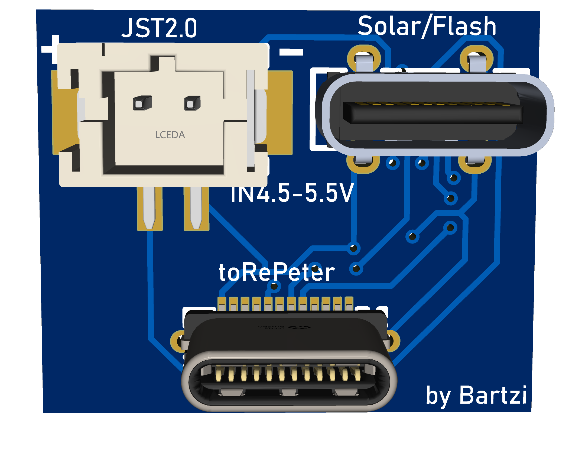
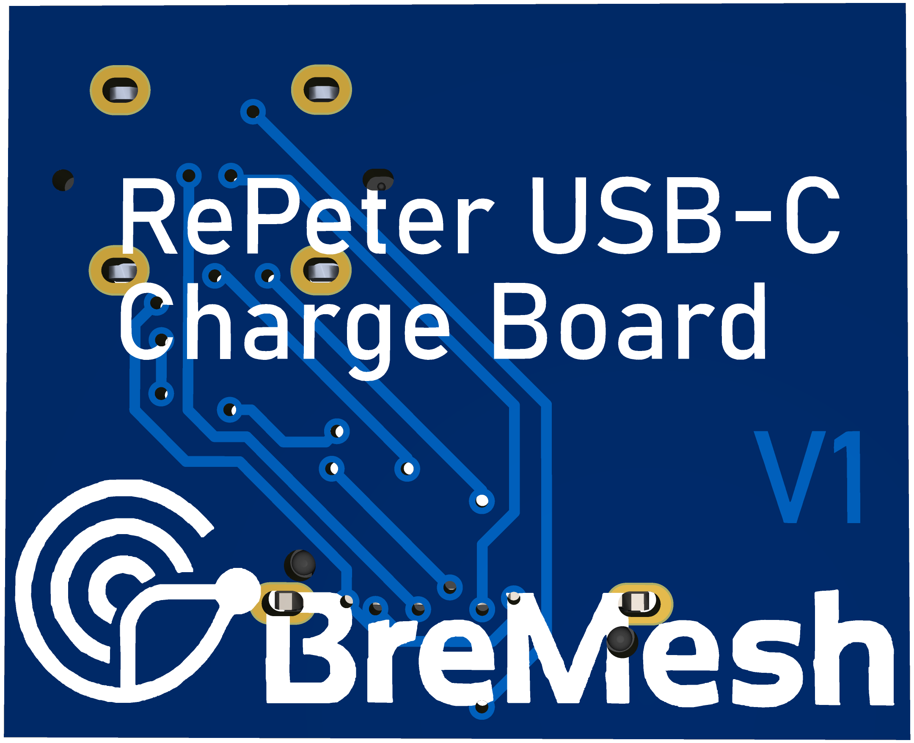

# USB-C Adapter für RePeter

Dieses kleine PCB ist ein USB-C Adapter für das BreMesh RePeter Projekt.

## Übersicht

Da der Platz im Gehäuse begrenzt ist, ist es leider nicht möglich ein USB-C Kabel direkt an den ProMicro anzuschließen. Da aber NUR über diesen USB-C Anschluss der Akkulade-Chip des ProMicros angeschlossen werden kann, habe ich dieses Adapterboard gebaut, um hier ein 5V Solarpanel via JST2 oder USB-C direkt an den Akkuladechip anzuschließen.

- **Tests und Entwicklung**: Via dem USB-C Solarpanel Port kann der RePeter ebenfalls geflashed/configuriert werden
- **Indoor-Betrieb**: Permanente Stromversorgung über USB-C Netzteil
- **Solarpanel Port**: Falls das 5V Solarpanel kein USB-C Stecker hat, kann es via JST2.0 angeschlossen werden

## Features

- ✅ JST2.0 neben dem Standard USB-C Anschluss
- ✅ Kompaktes Design
- ✅ Einfache Integration in das RePeter-System
- ✅ Kompatibel mit handelsüblichen 5V! USB-C Netzteilen oder Solarpanels

## 3D-Ansichten

### Vorderseite

### Rückseite

## Technische Daten

- **Eingangsspannung**: 4.5V-5.5 DC über USB-C oder Solar.
  - [Datenblatt](../Documentation/ProMicro/Charger-IC_LTH7R.PDF) des LTH7R IC
  - weiter Infos [LTH7R](https://hubtronics.in/lth7r)
- **Board-Version**: V1
- **Kompatibilität**: RePeter Boards

## Dateien in diesem Ordner

### Fertigungsdaten

- **[Gerber_USB-C_RePeter_V1.zip](Gerber_USB-C_RePeter_V1.zip)**: Gerber-Dateien für die PCB-Fertigung
- **[BOM_USB-C_Adapter_USB-C_RePeter_V1.xlsx](BOM_USB-C_Adapter_USB-C_RePeter_V1.xlsx)**: Stückliste (Bill of Materials) mit allen benötigten Bauteilen
- **[PickAndPlace_USB-C_RePeter_V1.xlsx](PickAndPlace_USB-C_RePeter_V1.xlsx)**: Pick-and-Place Datei für die automatische Bestückung

### Dokumentation

- **[SCH_USB-C_RePeter_V1.pdf](SCH_USB-C_RePeter_V1.pdf)**: Schaltplan des Adapters

### 3D-Visualisierung

- **[3D_USB-C_RePeter_V1_front.png](3D_USB-C_RePeter_V1_front.png)**: 3D-Ansicht der Vorderseite
- **[3DUSB-C_RePeter_V1_back.png](3DUSB-C_RePeter_V1_back.png)**: 3D-Ansicht der Rückseite
- **[3D_USB-C_RePeter_V1.zip](3D_USB-C_RePeter_V1.zip)**: 3D-Modell des Boards

## Fertigung

### PCB bestellen

1. Die [Gerber_USB-C_RePeter_V1.zip](Gerber_USB-C_RePeter_V1.zip) Datei bei einem PCB-Hersteller hochladen (z.B. JLCPCB, PCBWay, Aisler)
2. Standard-Einstellungen sind in der Regel ausreichend:
   - Material: FR4
   - Dicke: 1,6 mm
   - Kupferdicke: 1 oz
   - Oberflächenfinish: HASL oder ENIG

### Bauteile

Die benötigten Bauteile sind in der [BOM_USB-C_Adapter_USB-C_RePeter_V1.xlsx](BOM_USB-C_Adapter_USB-C_RePeter_V1.xlsx) aufgelistet.

### Bestückung

Bei automatischer Bestückung kann die [PickAndPlace_USB-C_RePeter_V1.xlsx](PickAndPlace_USB-C_RePeter_V1.xlsx) verwendet werden.

Alternativ kann das Board auch manuell bestückt werden.

## Installation

1. USB-C Adapter mit dem RePeter Board verbinden
2. 5V Solarpanel via JST oder USB-C verbinden
3. RePeter sollte nun mit Strom versorgt werden

## Hinweise

⚠️ **Wichtig**:

- Die Eingangsspannung darf nur zwischen 4.5V und 5.5V liegen.
- keine Solarpanels mit mehr als 5W benutzen.

## Support

Weitere Informationen zum RePeter Projekt findest du im [Haupt-README](../README.md).

BreMesh Projekt: https://bremesh.de/

EasyEDA BreMesh-Team: https://u.easyeda.com/bremesh

## Lizenz

Dieses Design ist Teil des BreMesh RePeter Projekts und steht für die Community zur Verfügung.

---

*Entwickelt für das BreMesh.de Projekt - Ein Mesh-Netzwerk für Bremen*
